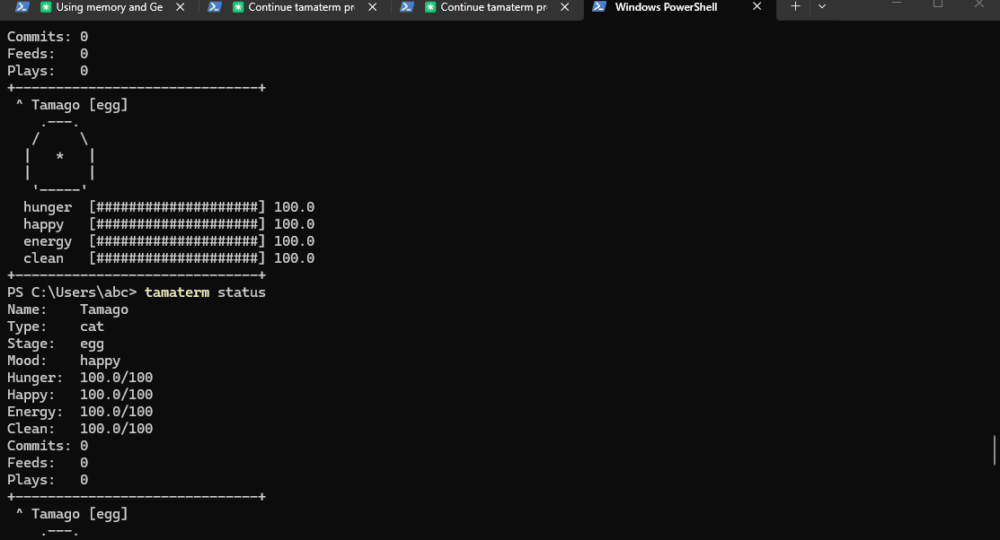

# tamaterm

A virtual pet that lives in your terminal.

```
┌────────────────────────┐
│ ★ Whiskers [adult]     │
│    /\_____/\           │
│   /  *   *  \          │
│  ( ==  w  == )         │
│   )    ♪    (          │
│  (           )         │
│  hunger  [████████████░░]  85.0 │
│  happy   [██████████████]  92.0 │
│  energy  [████████░░░░░░]  55.0 │
│  clean   [██████████░░░░]  70.0 │
└────────────────────────┘
```



## What is this?

tamaterm is a Tamagotchi-style virtual pet that lives in your terminal prompt.
It reacts to your developer workflow -- git commits make it happy, CPU spikes
stress it out, and it grows through life stages the longer you care for it.

**It's not a TUI app.** It lives *in* your prompt, above every command you type.

## Install

```bash
pip install tamaterm
```

## Quick Start

```bash
# Create your pet
tamaterm init Whiskers --type cat

# Install the shell hook (adds pet above your prompt)
tamaterm install

# Restart your terminal, then care for your pet
tamaterm feed
tamaterm play
tamaterm clean
```

## How it works

```
Background daemon (tamaterm daemon)
├── Monitors: git status, CPU, memory, time
├── Updates: ~/.tamaterm/pet.json (state)
└── Writes: ~/.tamaterm/status.txt (display)

Shell hook (in your .bashrc/.zshrc/profile)
└── cat ~/.tamaterm/status.txt before prompt

CLI (tamaterm feed/play/clean/sleep)
└── Modifies pet.json, daemon picks up changes
```

## Features

- **Growth system**: Egg -> Baby -> Teen -> Adult (care-dependent)
- **Reactive**: Happy when you commit code, stressed during CPU spikes
- **Stat decay**: Hunger, happiness, energy, hygiene decay over time
- **Night mode**: Pet sleeps automatically at night
- **Multi-shell**: Bash, Zsh, PowerShell, Fish
- **Cross-platform**: Linux, macOS, Windows
- **Lightweight**: 2 dependencies (click, psutil), ~50KB installed

## Pet Types

| Pet | ASCII | Personality |
|-----|-------|-------------|
| Cat | `/\_/\ (o.o)` | Independent, clean |
| Dog | `/\  /\ (o.o)` | Loyal, energetic |
| Slime | `(oo)` | Easy to care for |

## Commands

| Command | Effect |
|---------|--------|
| `tamaterm init` | Create a new pet |
| `tamaterm feed` | Feed your pet |
| `tamaterm play` | Play with your pet |
| `tamaterm clean` | Clean your pet |
| `tamaterm sleep` | Put pet to bed |
| `tamaterm status` | Show detailed stats |
| `tamaterm doctor` | Diagnose issues |
| `tamaterm install` | Install shell hook |
| `tamaterm uninstall` | Remove shell hook |
| `tamaterm start` | Start daemon |
| `tamaterm stop` | Stop daemon |
| `tamaterm revive` | Revive a dead pet |

## How the pet reacts

| Event | Pet reaction |
|-------|-------------|
| Git commit | Happiness +8 |
| New branch | Happiness +5 |
| CPU > 80% | Energy -5, Happiness -3 |
| Memory > 90% | Energy -3, Happiness -2 |
| Night (0-6am) | Auto-sleeps |

## Development

```bash
# Clone and install in dev mode
git clone https://github.com/violet2314275/tamaterm.git
cd tamaterm
pip install -e ".[dev]"

# Run tests
python -m pytest tests/ -v

# Lint
ruff check src/ tests/

# Build package
python -m build
```

## Contributing

Add a new pet! Create a file in `src/tamaterm/art/` with ASCII art for each
stage and mood. See `art/cat.py` for the pattern.

Each pet needs art for these moods at each stage (egg, baby, teen, adult):
`NORMAL`, `HAPPY`, `HUNGRY`, `SAD`, `SLEEPING`, `DEAD`.

## License

MIT
